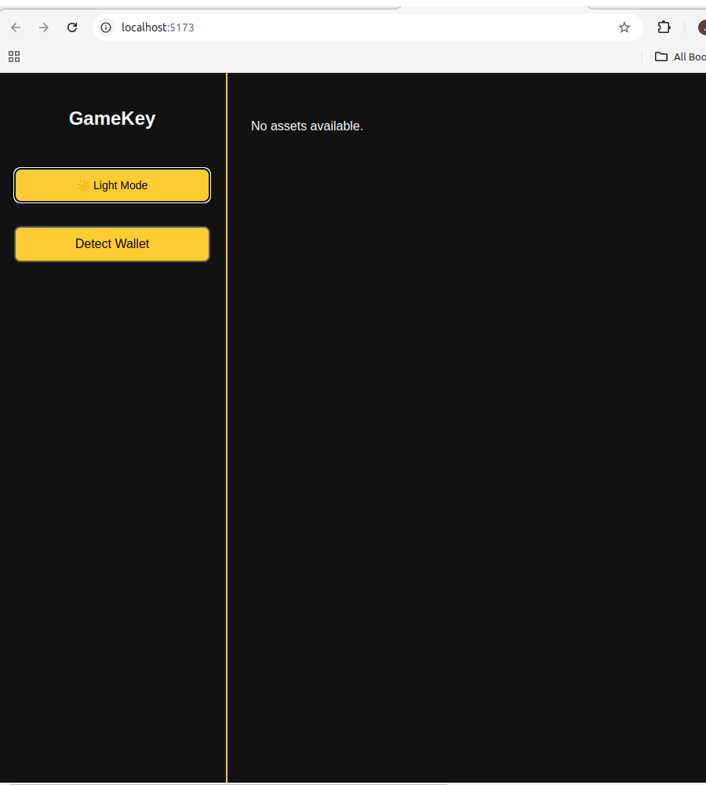
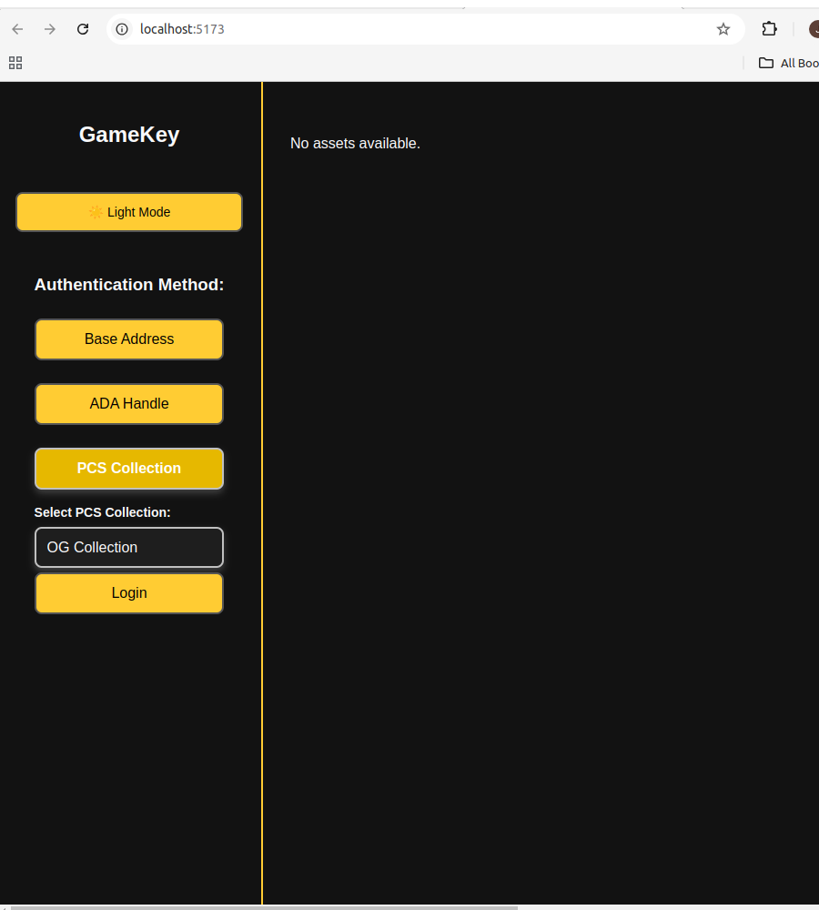
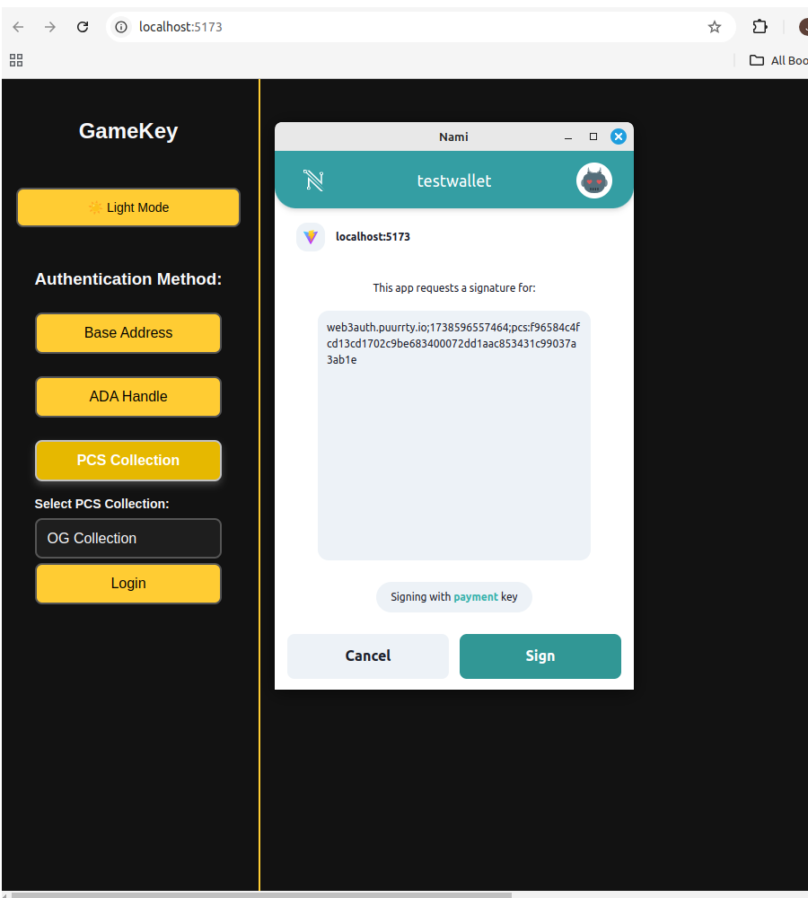
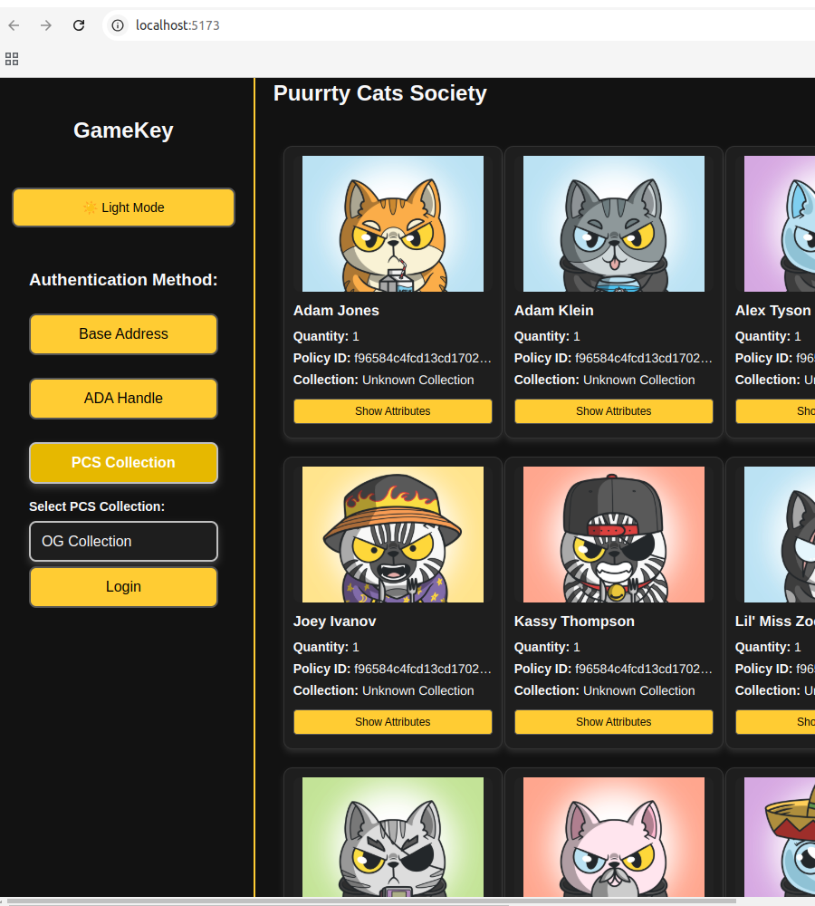

# GameKey Web3 DDID(Decentralized Digital Identity) Login - Password-less, Secure Authentication

<div style="display: grid; grid-template-columns: repeat(2, 1fr); gap: 10px;">
  
  
  
  
</div>

GameKey Web3 Login offers a **secure, password-less authentication system** leveraging the **Cardano blockchain**. With GameKey, users authenticate using their **Cardano wallet’s cryptographic signature**, eliminating the need for usernames and passwords while ensuring **maximum security** and **privacy**. This solution is ideal for **dApps, gaming platforms, DAOs, marketplaces**, and any Web3-based application requiring **seamless, decentralized authentication**.

> **Note:** This version uses a **Decentralized Identifier (DID)** approach instead of traditional JWT tokens. Users sign a nonce with their wallet’s private key, and the backend generates a DID token from their Cardano address. This ensures a fully stateless and decentralized authentication flow.

---

## Key Features

- **Decentralized Identity (DID):**  
  Authenticate users via cryptographic wallet signatures. The backend derives a unique DID token from the Cardano wallet’s base address (Bech32 format), ensuring that authentication is decentralized and user-controlled.

- **Stateless Decentralized Authentication:**  
  Eliminate session storage and traditional JWT tokens. The DID token is generated on-demand and verified on each request without any centralized session management.

- **Cardano Blockchain Integration:**
    - **Token-Gating:** Restrict access based on wallet holdings.
    - **ADA Handle Support:** Verify addresses through ADA Handles.
    - **PCS Collection Support:** Login via PCS collections or ADA handles.
    - **UTXO & Asset Management:** Fetch and display wallet assets for seamless interaction with smart contracts.

- **Privacy-Centric:**  
  No personal data is stored on the server. The system relies solely on cryptographic proofs from the Cardano wallet, aligning with core Web3 privacy principles.

- **Multi-Platform Support:**  
  Designed for use across **gaming platforms**, **marketplaces**, **DAOs**, **DeFi applications**, and other decentralized applications.

- **Asset Display & Interaction:**  
  Retrieve wallet assets (UTXOs, tokens) and enable interaction with on-chain smart contracts, making it easy to integrate with various Web3 functionalities.

---

## How It Works

1. **Nonce Generation:**  
   When a user initiates login, the backend generates a unique nonce (a random challenge string) tied to the user's Cardano base address.
    - The nonce includes additional options such as ADA handle and PCS policy IDs.
    - This nonce is stored temporarily and sent back to the client.

2. **Signature & Authentication:**  
   The user connects their Cardano wallet and is prompted to sign the nonce with their private key.
    - The signed nonce (data signature) is then sent back to the backend.
    - The backend verifies the signature using CIP-30 standards. If the signature is valid and the nonce matches, authentication is successful.

3. **DID Token Generation:**  
   Instead of issuing a JWT, the backend generates a **Decentralized Identifier (DID) token** by hashing the user’s Cardano base address.
    - This DID token is then returned to the client as proof of authentication.
    - For subsequent API calls, the client includes the DID token (e.g., in the `Authorization` header as `DID <token>`).

4. **Secured API Access:**  
   A custom security filter intercepts requests, extracts the DID token, and verifies that it matches the expected format.
    - If valid, the request is allowed to proceed; otherwise, the user receives an unauthorized error.

---

## Installation

### Prerequisites

Ensure you have the following installed before getting started:

- **Java JDK 17+** (for the backend)
- **Node.js & npm** (for frontend development)
- **Maven** (for building the backend)
- **PostgreSQL** *(optional, for database persistence)*

### Backend Setup

1. **Clone the Repository:**
   ```bash
   git clone https://github.com/PatrickJamesRepo/GameKey
   cd GameKey
