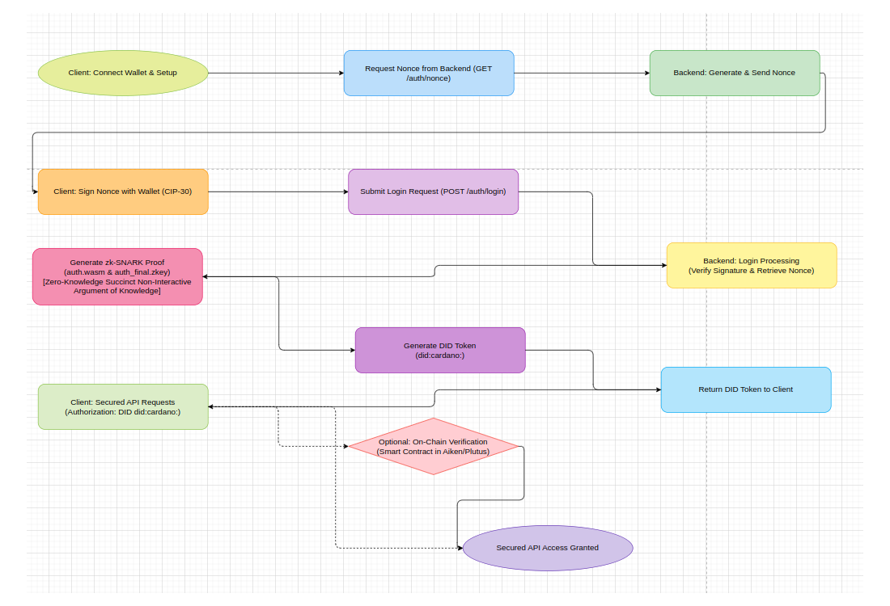

# GameKey Web3 DDID (Decentralized Digital Identity) Login - Password-less, Secure Authentication

[](https://www.oracle.com/java/)
[](https://maven.apache.org/)
[](https://nodejs.org/)
[](LICENSE)
[](https://github.com/PatrickJamesRepo/GameKey/actions)

<div style="display: grid; grid-template-columns: repeat(3, 1fr); gap: 10px;">
  
  
  
  
  
</div>

GameKey Web3 Login provides a secure, password-less authentication system by leveraging the Cardano blockchain. Users authenticate using their Cardano wallet’s cryptographic signature, thereby eliminating the need for traditional credentials while maintaining maximum security and privacy. This solution is ideal for dApps, gaming platforms, DAOs, marketplaces, and other Web3 applications that require seamless, decentralized authentication.

> **Note:** This implementation uses a Decentralized Identifier (DID) approach rather than traditional JWT tokens. Users sign a nonce with their wallet’s private key, and the backend generates a DID token based on their Cardano address. In addition, a zk‑SNARK proof is generated to validate the signature without exposing sensitive information, ensuring a stateless and privacy-preserving authentication flow.

---

## Key Features

- **Decentralized Identity (DID):**  
  Authenticate users through cryptographic wallet signatures. A unique DID token is derived from the Cardano wallet’s base address (in Bech32 format), ensuring that authentication remains decentralized and user-controlled.

- **Stateless Authentication:**  
  Eliminate the need for session storage and traditional JWT tokens. The DID token is generated on demand and verified with every request, avoiding centralized session management.

- **Cardano Blockchain Integration:**
    - **Token-Gating:** Restrict access based on wallet holdings.
    - **ADA Handle Support:** Verify addresses using ADA Handles.
    - **PCS Collection Support:** Support login via PCS collections or ADA handles.
    - **UTXO & Asset Management:** Retrieve and display wallet assets to enable seamless interaction with smart contracts.

- **Zero-Knowledge Proof (zk‑SNARK) Integration:**  
  Enhance privacy with a succinct zero‑knowledge proof. This zk‑SNARK confirms that the user has signed the nonce with the correct private key without revealing any sensitive data.

- **Privacy-Centric Architecture:**  
  No personal data is stored on the server. Authentication relies solely on cryptographic proofs from the Cardano wallet, adhering to core Web3 privacy principles.

- **Multi-Platform Support:**  
  Designed for gaming platforms, marketplaces, DAOs, DeFi applications, and other decentralized applications.

- **Asset Display & Interaction:**  
  Retrieve wallet assets (UTXOs, tokens) and facilitate interaction with on-chain smart contracts.

---

## How It Works

1. **Nonce Generation:**  
   When a login is initiated, the backend generates a unique nonce (a random challenge string) associated with the user's Cardano base address.
    - The nonce may include additional parameters such as ADA handle and PCS policy IDs.
    - The generated nonce is stored temporarily and then sent to the client.

2. **Signature & Authentication with zk‑SNARK:**  
   The user connects their Cardano wallet and is prompted to sign the nonce using their private key.
    - The resulting signed nonce (data signature) is transmitted back to the backend.
    - The backend verifies the signature according to CIP‑30 standards.
    - **Zero-Knowledge Proof Generation:**  
      In parallel, a zk‑SNARK proof is created, demonstrating that the nonce was signed correctly without revealing the private key or other sensitive information.

3. **DID Token Generation:**  
   Rather than issuing a JWT, the backend generates a Decentralized Identifier (DID) token by hashing the user's Cardano base address.
    - The resulting DID token (formatted as `did:cardano:<hash>`) is returned to the client as proof of authentication.
    - For subsequent API calls, the client includes the DID token in the `Authorization` header (e.g., `Authorization: DID <token>`).

4. **Secured API Access:**  
   A custom security filter intercepts incoming requests, extracts the DID token, and verifies that it conforms to the expected format.
    - If valid, the request is permitted; otherwise, the system returns an unauthorized error.

---

## Software Design Principles

To ensure a robust, maintainable, and scalable authentication system, GameKey adheres to modern software design practices and the SOLID principles:

### SOLID Principles

- **Single Responsibility Principle (SRP):**  
  Each module (e.g., authentication controller, DID service, security filter) is responsible for a single aspect of the system, enhancing clarity, testability, and maintainability.

- **Open/Closed Principle (OCP):**  
  Components are designed to be extensible without requiring modification to existing code, facilitating the addition of new authentication methods or wallet integrations.

- **Liskov Substitution Principle (LSP):**  
  Different wallet implementations (e.g., Nami, Flint) can be substituted without affecting system behavior.

- **Interface Segregation Principle (ISP):**  
  Interfaces are narrowly defined to ensure components only depend on the functionality they require.

- **Dependency Inversion Principle (DIP):**  
  High-level modules depend on abstractions rather than concrete implementations, decoupling components and promoting flexibility and easier testing.

### Additional Design Principles

- **Separation of Concerns:**  
  The system separates responsibilities among the frontend, backend, and smart contract layers, reducing complexity and improving modularity.

- **Decoupling & Modularity:**  
  By utilizing DID tokens for stateless authentication and integrating zk‑SNARK proofs, the authentication process is decoupled from session management, enhancing security and scalability.

- **Scalability:**  
  The architecture is designed to accommodate future features (e.g., multi-wallet support, token gating, on-chain verification) as the system evolves.

- **Security by Design:**  
  Emphasis on cryptographic verification and zero-knowledge proofs ensures that the authentication process maintains high security and privacy standards throughout.

---

## Installation

### Prerequisites

Before getting started, ensure you have the following installed:

- **Java JDK 17+** (for the backend)
- **Node.js & npm** (for frontend development)
- **Maven** (for building the backend)
- **PostgreSQL** *(optional, for database persistence)*

### Backend Setup

1. **Clone the Repository:**
   ```bash
   git clone https://github.com/PatrickJamesRepo/GameKey
   cd GameKey
